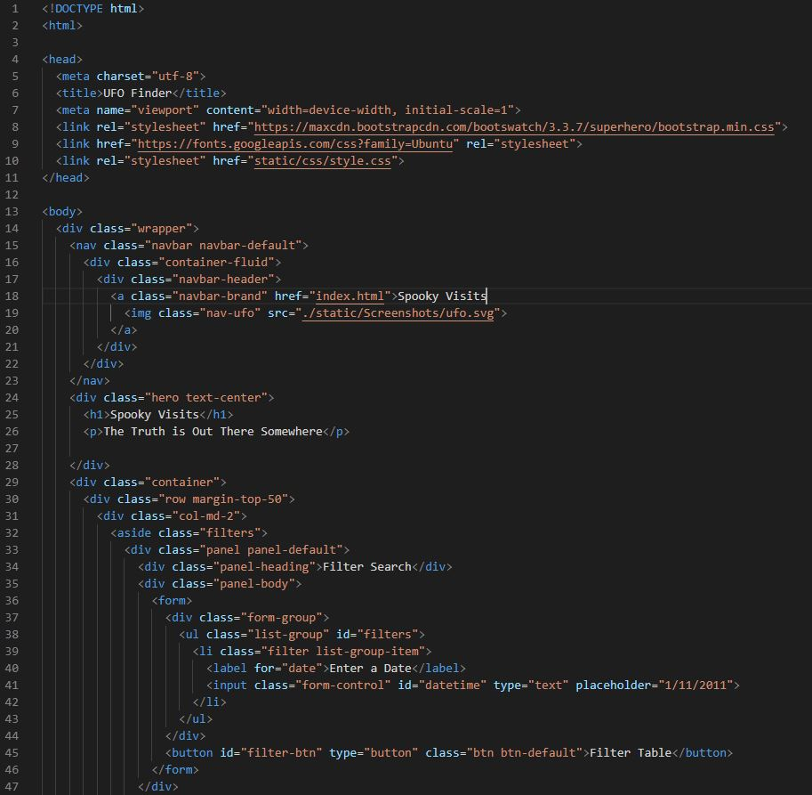
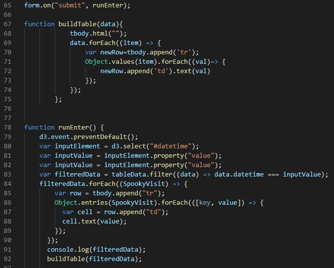
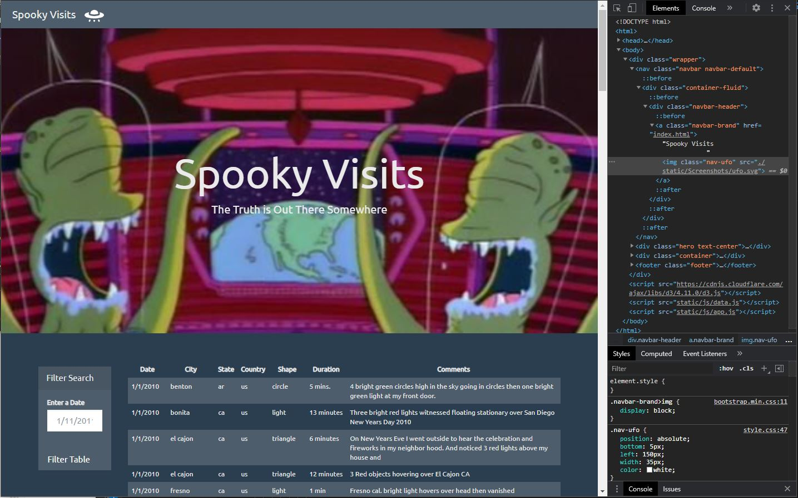
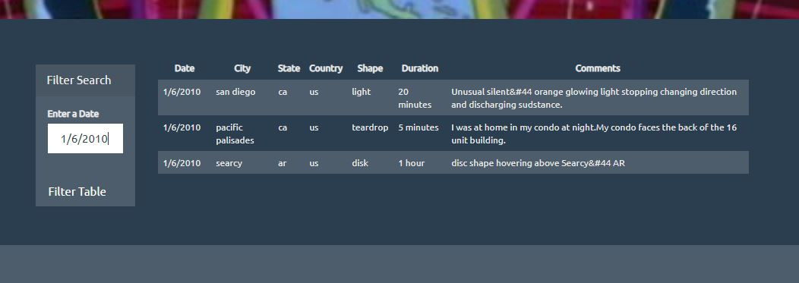

# JavaScript and DOM Manipulation

## Project Purpose

Create a dynamic table based upon UFO sightings dataset that will enable users to search and filter the table data for specific values. Utilizing JavaScript, HTML, CSS and D3.js to create our webpage.

## Process - Automatic Table and Date Search

### Step 1 - Creating our own HTML webpage
- Code Snippet from HTML Page 

### Step 2 - Writing JavaScript Code to Append Table
- Using the JavaScript to write code that appends a table to the web page 
  and then adds new rows of data for each UFO sighting
    - Sample Code Snippet 

### Step 3 - Incorporating Date Form in HTML with JavaScript
- Function will listen for events and search through the date/time column to 
  find rows that match user input

## Results

### UFO Search Landing Page

### Table Filter by Date

